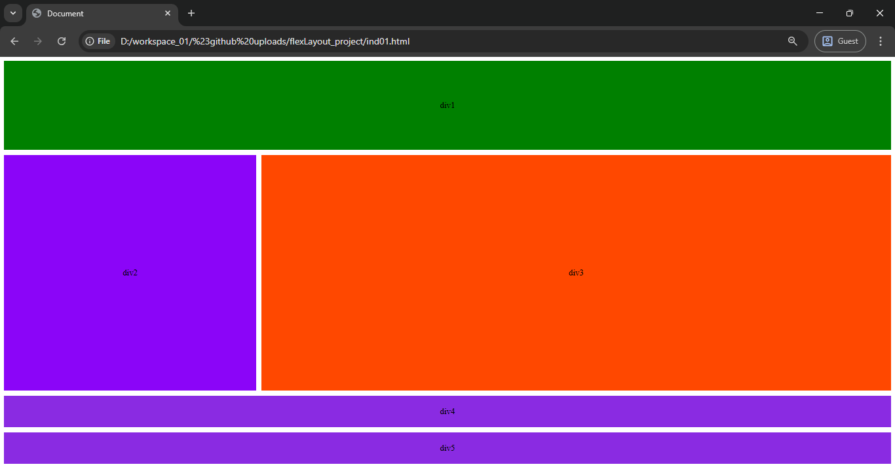

# Flex Layout Project 

## Table of contents

- [Overview](#overview)
  - [The challenge](#the-challenge)
  - [Screenshot](#screenshot)
  - [Built with](#built-with)
- [Author](#author)

## Overview

A responsive Flexbox layout project demonstrating multi-section flexible grids, alignment, and responsive breakpoints.

### The challenge

Users should be able to:

Build a responsive layout using HTML and CSS Flexbox.

Adjust layout across breakpoints:

Default large screens

Max-width 760px

Max-width 320px

Ensure all divs center their content using Flexbox alignment.

Maintain consistent spacing and alignment across containers using gap, flex-basis, and flex-wrap.

### Screenshot

Image.png

### Built with

- HTML5

- CSS3 (Flexbox)

- Mobile-first responsive design practices

## Author

- Frontend Mentor - [@shrikanth-dev]
- LinkedIn - [@G Srikanth](https://www.linkedin.com/in/g-srikanth-gs)
